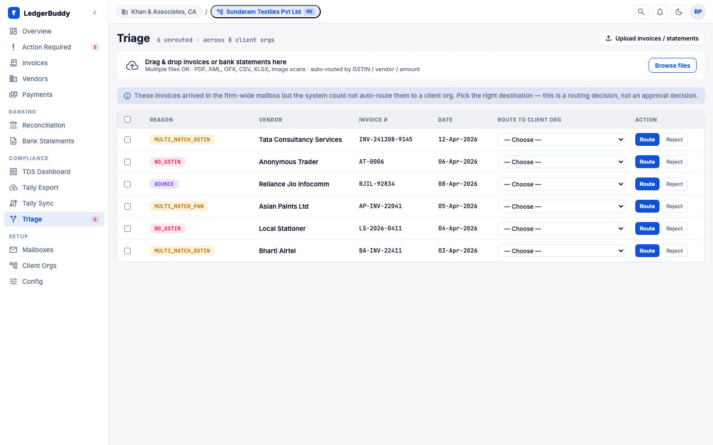
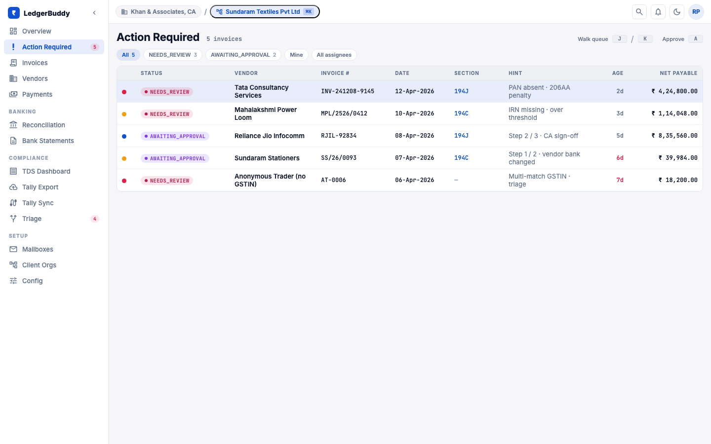
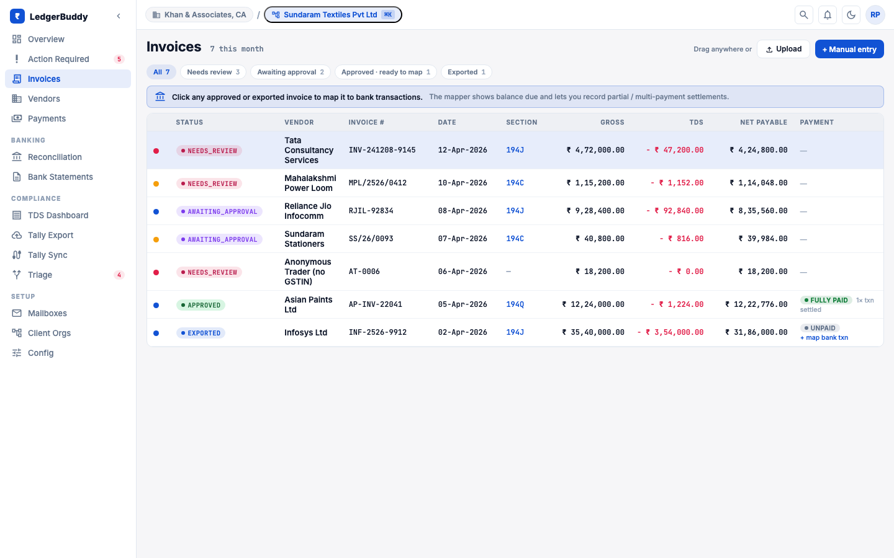
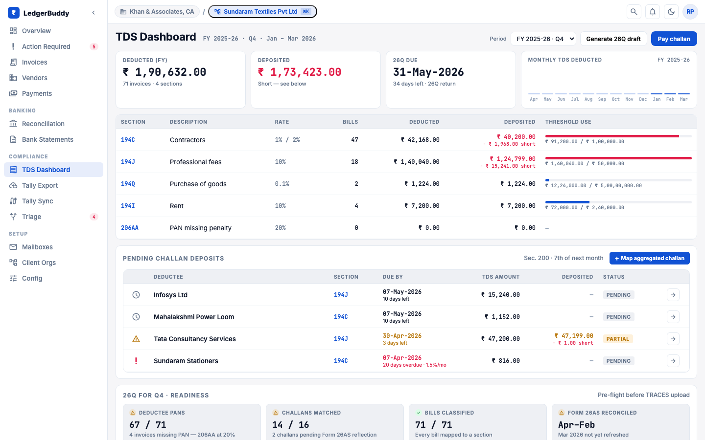
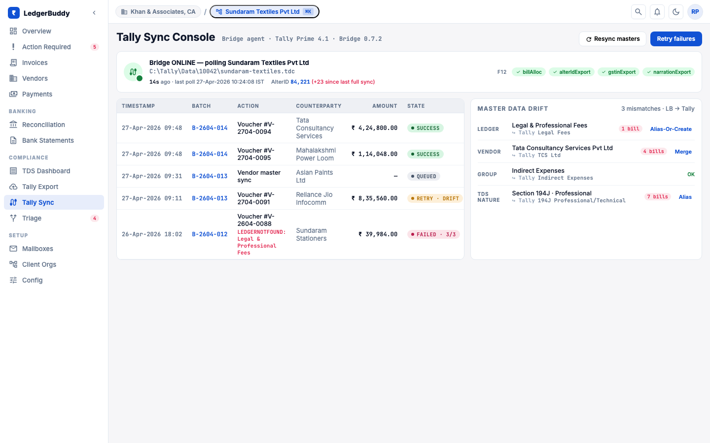
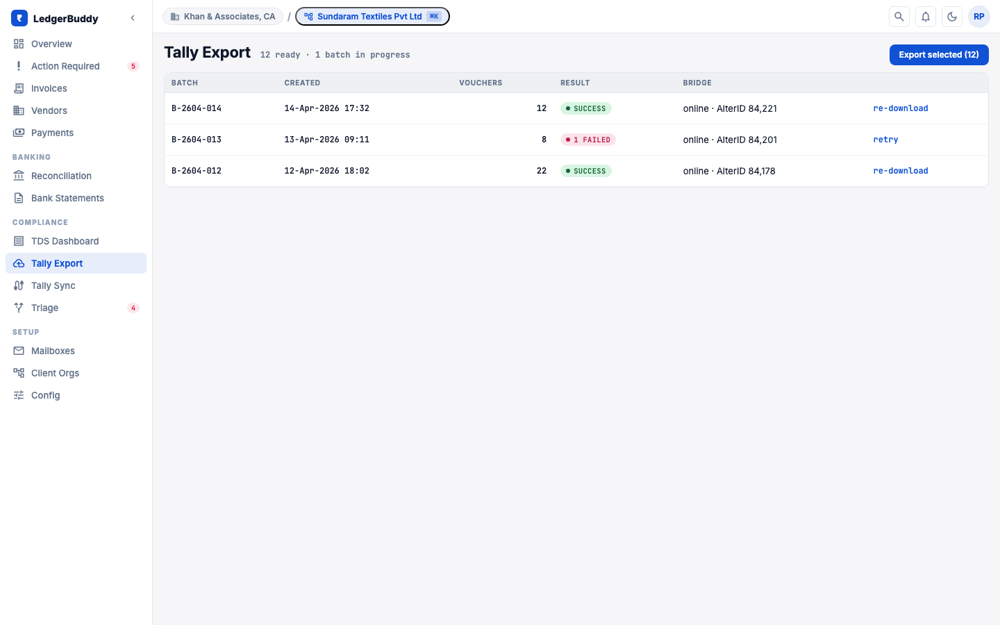
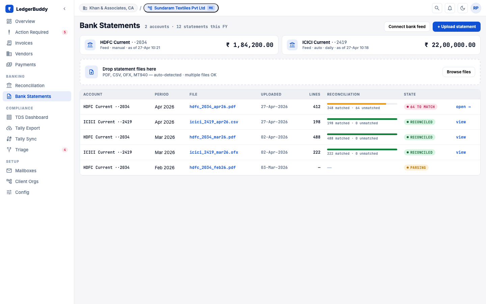

# LedgerBuddy

Accounts payable for Indian Chartered Accountant firms.

LedgerBuddy is a multi-tenant AP platform built for the operator who runs accounts payable across many client organisations. One firm, many client orgs: every client org is an isolated realm with its own vendor master, GST/TDS configuration, approval workflow, and Tally Prime company. The differentiator versus generic AP tools is GSTIN-first compliance, dual-tagged ledger XML that Tally Prime actually accepts on import, and a CA-firm topology where one operator switches across realms without leaving the app.

The product was previously called BillForge; the codebase, package names, and design canvas have all moved to LedgerBuddy. A handful of legacy artefacts (e.g. `docs/architecture.drawio`) still carry the old name and will be renamed in-flight.


## Why it exists

A typical CA firm receives invoices into a shared mailbox or Drive folder for each of fifteen to fifty client organisations. Junior accountants triage each invoice by hand: identifying which client org it belongs to from the GSTIN on the bill, checking that the GSTIN is active, splitting CGST/SGST/IGST against the place of supply, deciding the TDS section (94C, 94J, 94H, 194Q, others), confirming whether the cumulative-year deduction has crossed a threshold, flagging MSME vendors against the 45-day payment rule, and finally typing the voucher into Tally Prime at month end. Payments are scheduled separately, often in a spreadsheet, and reconciled against bank statements long after the cash has moved.

The failure modes are predictable. Invoices drop on the floor when a mailbox is shared across firms. TDS sections get mis-classified, exposing the deductor in scrutiny. MSME vendors crossing the forty-five day window aren't surfaced until they complain. Tally rejects month-end imports because `BILLALLOCATIONS` is missing or `ALLLEDGERENTRIES.LIST` is structurally wrong, and the exporter has to be re-run line by line. Payment vouchers and purchase vouchers diverge from the recorded reality.

LedgerBuddy compresses this. Invoices ingest from Gmail, MailHog (in dev), or upload. OCR plus an SLM extracts canonical fields with bounding boxes and confidence scores. India-specific compliance enrichment runs as a pipeline stage: GSTIN/PAN cross-check, place-of-supply tax split, TDS section detection with rate hierarchy, cumulative-threshold tracking against `TdsVendorLedger`, MSME flag, Section 197 lower-deduction certificate lookup. A human-in-the-loop reviews only what the pipeline flagged. Tally export emits structurally correct XML that Tally Prime imports without remediation. Payment recording, reversals, and bank-side reconciliation close the loop.


## The product surface

The screenshots below are captured from the post-Wave-3 design canvas at 1440x900. The shipped app is a single React SPA with a left sidebar plus a top realm-switcher shell; `Cmd-K` switches client org, `Cmd-\` collapses the sidebar.


### Triage and routing

Mail arrives in the firm's ingestion mailboxes. Each mailbox tracks a thirty-day ingestion count and exposes a recent-ingestions drawer so the operator can audit what landed today and where it went.


Auto-routing places an invoice into a client org when the GSTIN on the bill resolves unambiguously to one of the firm's registered realms. When it doesn't (no GSTIN on the bill, the GSTIN matches multiple registered orgs, the PAN matches multiple orgs, or the message bounced), the invoice surfaces in firm-wide Triage with a reason chip and a route-to dropdown. The operator either routes or rejects in one click.



Once an invoice is in a client org, anything the pipeline couldn't decide on its own surfaces in the Action queue. The walk-queue is keyboard-driven so a junior accountant can clear ten invoices a minute without leaving their hands on the trackpad.




### Invoice lifecycle

The invoice list is the canonical record. Each row carries status, vendor, invoice number, document date, detected TDS section, age, and net payable after TDS. Filters compose; a saved view is a URL.



Vendors carry their own master record. The list view is the high-frequency surface (search, filter by deductee type, filter by MSME flag, sort by lifetime spend). The detail page (Phase 2, in progress) carries an Invoices sub-tab, a TDS sub-tab with cumulative ledger, a Section 197 certificate panel, and an atomic merge dialog for de-duplicating vendors that arrived with two GSTINs across realms.


### Compliance and TDS

The TDS dashboard is the surface a CA spends the most time on at quarter-end. The FY switcher selects the financial year; the quarter drill-down breaks liability into Q1 to Q4. The KPIs surface deducted, deposited, and pending challan amounts. The cumulative-threshold chart is the single best place to see which vendor will cross 194Q or 94C thresholds before they actually do.



Tally Sync is the operator's view of the bridge agent's health: connection status, the last-applied AlterID watermark from the Tally company, and the recent sync history with success / partial / failed state per batch.



Tally Export is the batch tracker: which export batch went out, which lines failed against which `LINEERROR` ordinal, and a one-click retry-failed for transient errors plus re-download for completed batches. AlterID is surfaced per row so the operator can correlate against Tally Prime's own audit trail.



> [!NOTE]
> Tally export emits structurally correct `ALLLEDGERENTRIES.LIST` plus `BILLALLOCATIONS` with `New Ref`, `<REFERENCE>` and `<EFFECTIVEDATE>` populated, `ISINVOICE=Yes`, and a deterministic GUID per voucher so re-export is idempotent. The contract is enforced in the XML builder and exercised by fixture tests against a real Tally Prime company.


### Money movement

Payments handles single-invoice, multi-invoice, advance, and reversal flows. Method-specific validation runs inline (RTGS / NEFT IFSC + account-number checks; UPI VPA shape; cash-payment-above-limit risk signal). MSME-overdue rows are highlighted before the operator schedules anything; the 45-day clock is computed against the invoice's document date, not its receipt date.


Reconciliation lands as a junction-table model in Phase 5. The matcher proposes splits and aggregates (one bank line that pays two invoices; two bank lines that pay one invoice) and the operator confirms. TDS-adjusted scoring uses a +/- 2 day tolerance on settlement date so common one-day-off bank credits don't show as unmatched.


Bank statements are the source of truth on the cash-out side. Each uploaded statement parses into rows, the rows feed reconciliation, and the per-statement view exposes parsed-row counts and current reconciliation status so an operator can tell at a glance which months are clean.




### Multi-tenant operations

The dashboard is the per-realm landing page. KPIs across the active client org, the Action-required queue inline, the payable-trend chart, the section-wise TDS-deducted breakdown, and a recent-activity feed.


Client orgs is the firm-level admin surface: every client org the firm operates, with linked-record counts (invoices, vendors, payments, exports) and archive controls. Archiving asks for explicit confirmation when the linked-record count is non-zero.


Tenant config is the single page where the firm tunes per-realm policy: compliance thresholds and TDS section overrides, ingestion sources and routing rules, and the approval policy (single-step, two-step, value-tier).


## Architecture

LedgerBuddy is a Node + React monorepo over a single multi-tenant Mongo cluster.

- **Multi-tenant Mongo** — Mongo Atlas in production, local Mongo 7 via Docker for dev. Every collection carries a `tenantId` discriminator; per-realm data is scoped server-side via a request-scoped resolver.
- **Backend** — Node 20 + TypeScript 5 strict + Express 4 + Mongoose 8 + Zod 3. URL providers are typed end-to-end (`backend/src/routes/urls/*Urls.ts`, `backend/src/integrations/urls/*Urls.ts`); no raw path strings live at routers or call sites. The contract is enforced in CI by the URL-provider sweep that landed with #228.
- **Frontend** — React 18 + Vite 6 + TypeScript strict + Zustand 5 + Recharts. State migrated off hand-rolled stores and Context to a unified Zustand surface in #173. URL providers mirror the backend layout under `frontend/src/api/urls/*Urls.ts`. Functional pass and design pass ship as separate PRs per the FE split convention.
- **Ingestion** — Gmail OAuth in production, MailHog in dev, S3 / MinIO drop, manual upload. Each invoice carries source mailbox plus receipt timestamp.
- **OCR + extraction pipeline** — composable per launch profile: Apple Vision, DeepSeek MLX, or LlamaParse for OCR; LlamaExtract, MLX SLM, Claude CLI, or the Anthropic API for field extraction. Confidence scoring with per-field bounding boxes flows through to the review UI.
- **Tally Prime integration** — file-based XML download today (`ALLLEDGERENTRIES.LIST` + `BILLALLOCATIONS` + `ISINVOICE=Yes`, deterministic GUID, dual-tag emission for ledger/voucher correctness). Phase 6+ moves to a desktop bridge agent over OAuth.
- **FE / BE alignment** — the e2e harness from #219 runs nested-mount integration tests against the live API; the typed URL-provider abstraction (#228 BE, #228-A FE) replaces the historical contract walker.

For depth, see:

- [docs/architecture.drawio](docs/architecture.drawio) — system diagram
- [docs/COMPOSABLE_PIPELINE.md](docs/COMPOSABLE_PIPELINE.md) — OCR + extraction pipeline composition
- [docs/accounting-payments/RFC-BACKEND.md](docs/accounting-payments/RFC-BACKEND.md) — backend RFC for the accounting-payments initiative
- [docs/accounting-payments/RFC-FRONTEND.md](docs/accounting-payments/RFC-FRONTEND.md) — frontend RFC for the same initiative


## Phase 0 to 5 roadmap

The accounting-payments initiative formalises payment recording, TDS cumulative tracking, Tally XML correctness, vendor CRUD, and reconciliation v2. Source of truth: [docs/accounting-payments/MASTER-SYNTHESIS.md](docs/accounting-payments/MASTER-SYNTHESIS.md), with backend and frontend RFCs alongside it. Tracking labels on GitHub: `accounting-payments`, `phase:N-*`. The MVP target is Phase 0 + 1 + 2 + 3 + 4 plus UX quick wins (~14 weeks); Phase 5 lands shortly after.


### Phase 0 — Tally purchase-voucher XML correctness

**Shipped.** The export builder emits `ALLLEDGERENTRIES.LIST` with the full ledger entry set, `BILLALLOCATIONS` with `New Ref` plus `<REFERENCE>` and `<EFFECTIVEDATE>`, `ISINVOICE=Yes` on every voucher, and a deterministic GUID so re-export is idempotent against a target Tally company. Fixture tests assert structural shape against captured Tally Prime imports.


### Phase 0.5 — Export batch correlation and re-export

**In progress.** Closing the gap between exporter and operator when a single line in a batch fails.

- `ExportBatch` per-invoice items so the operator sees which invoice failed, not just the batch (#277).
- Re-export-failures endpoint scoped to the failed subset, no double-emission of successful vouchers (#277).
- `LINEERROR` ordinal correlation that maps Tally's error positions back to the source invoice id (#277).


### Phase 1 — TDS cumulative tracking

**In progress.** Cumulative tracking is the substrate the rest of the compliance story rides on.

- `TdsVendorLedger` model + service with atomic `$inc`, FY/quarter utilities (#255).
- Pure-fn `TdsCalculationService` refactor with rate hierarchy and cumulative integration (#256).
- Idempotent, cursor-based backfill migration with dry-run gate (#257).
- `GET /api/reports/tds-liability` returning the cumulative ledger plus TAN (#258).
- TDS Dashboard FE — FY switcher, quarter drill-down, KPIs, liability table, cumulative chart (#259).
- `AuditLog` model + service: immutable, fire-and-forget, dead-letter retry (#260).
- FY archival, 16MB subdoc split, concurrency chaos harness (#278).
- RUNBOOK-2 TDS + AuditLog operations (#279).


### Phase 2 — Vendor master CRUD and merge

**Upcoming.** The vendor record is the single most-edited entity after the invoice itself; making it first-class unblocks the rest.

- `VendorMaster` plus tenant fields: TAN, Section 197 cert, `tallyLedgerName`, deductee type, MSME history (#261).
- `VendorService` CRUD plus atomic merge that consolidates ledgers across two vendor ids, plus Section 197 certificate upload (#262).
- Vendor list FE — search, filter, sort, pagination, virtualised (#263).
- Vendor detail FE — Invoices and TDS sub-tabs, Section 197 cert panel, merge dialog (#264).
- RUNBOOK-4 Vendor operations (#280).


### Phase 3 — Payment recording

**Upcoming.** The first phase that records cash leaving the firm.

- `Payment` model plus invoice `paymentStatus`, `paidAmountMinor`, `gstTreatment` fields and capability flags (#265).
- `PaymentService` plus routes, allocation, duplicate-UTR guard, multi-document transactional `paymentStatus` recompute (#266).
- Payment reversal flow plus a `CASH_PAYMENT_ABOVE_LIMIT` risk signal (#267).
- Payment recording UI — single, multi-invoice, advance, reversal — with method-specific validation (#268).
- Payment + aging columns on the invoice table plus a per-invoice payment-history panel (#269).
- RUNBOOK-5 Payment operations (#281).


### Phase 4 — Payment voucher Tally export

**Upcoming.** Once payments record, the export side has to follow.

- Payment-voucher XML builder with `BILLALLOCATIONS Agst Ref`, GUID, batch chunking (#270).
- `POST /exports/tally/payment-vouchers` endpoint with per-tenant mutex and `ExportBatch` tracking (#271).
- Payment-voucher export panel UI: bulk-select, progress modal, re-export failures (#272).


### Phase 5 — Reconciliation v2

**Upcoming.** Closes the loop from invoice to bank line.

- `ReconciliationMapping` junction-table model and repository with explicit indexes (#273).
- Dual-write shim, cursor backfill, nightly consistency check (#274).
- TDS-adjusted scoring with +/- 2 day tolerance, junction-read cutover, benchmark gate (#275).
- Split / aggregate detection (subset-sum <= 10) plus manual mapping endpoints, inline panels in `BankStatementsTab` (#276).
- Aging report endpoint and view with Current / 1-30 / 31-60 / 61-90 / 90+ buckets and an MSME 45-day-overdue split (#282).

> [!NOTE]
> The MSME 45-day rule (Micro, Small and Medium Enterprises Development Act, 2006) requires payment to a registered MSME vendor within forty-five days of accepted goods or services. LedgerBuddy computes the deadline against the invoice's document date and surfaces overdue rows in the Payments queue, the aging report, and the dashboard's recent-activity feed.

Cross-cutting infrastructure (typed URL provider coverage, walker enforcement, Zustand store coverage follow-ups) is tracked under `infra:typed-url-coverage` and related sub-issues; see `feedback_freeze_features_until_wave3.md` for the current freeze status.


## Local development

Prerequisites: Node 20+, Yarn 4+ (Berry, the repo is a Yarn workspace), Docker, Python 3.11+ (Apple Silicon recommended for local MLX).

A clean day-1 sequence:

```bash
git clone <repo-url> && cd LedgerBuddy
yarn install
export LLAMA_CLOUD_API_KEY=...   # required for the lowcost preset
yarn docker --preset=llamaextract-lowcost
open http://localhost:5177       # log in as tenant-admin-1@local.test / DemoPass!1
```

The stack seeds two demo tenants, a sample realm, and a handful of pre-ingested invoices so the action queue, vendors list, and TDS dashboard all have content on first boot.


### Service map

| Service        | Host URL                  |
|----------------|---------------------------|
| Frontend       | `http://localhost:5177`   |
| Backend API    | `http://localhost:4100`   |
| Keycloak       | `http://localhost:8280`   |
| MinIO console  | `http://localhost:9101`   |
| MongoDB        | `localhost:27018`         |
| Mongo Express  | `http://localhost:8181`   |
| MailHog        | `http://localhost:8125`   |
| Redis          | `localhost:6379`          |


### Launch profiles

LedgerBuddy uses a composable profile system rather than per-combination scripts. Dimensions: `--engine={claude|mlx|codex|api}`, `--ocr={default|apple_vision|llamaparse}`, `--extraction={default|single|multi}`. Presets compose dimensions and are first-writer-wins under explicit flags.

```bash
yarn docker --preset=llamaextract-lowcost          # managed cloud, fastest path
yarn docker --engine=claude --extraction=multi     # local Claude CLI
yarn docker --engine=mlx --extraction=single       # local MLX
yarn docker --preset=claude-single-apple           # Apple Vision + Claude
yarn docker --engine=api --ocr=llamaparse          # LlamaParse + Anthropic API
yarn profile:list                                  # all options
```

Full matrix: [docs/LAUNCH_PROFILES.md](docs/LAUNCH_PROFILES.md).


### Stack management

```bash
yarn docker:down          # stop stack, keep ML services warm
yarn docker:down:all      # stop everything
yarn docker:reload        # rebuild and restart
yarn slm --engine=mlx     # restart SLM only
yarn logs:local           # tail all service logs
```


### Day-to-day commands

```bash
yarn dev                  # backend + frontend in watch mode against the running stack
yarn test                 # unit tests, BE + FE
yarn coverage:check       # threshold-enforced coverage
yarn knip                 # dead-code analysis (CI gate)
yarn quality:check        # knip + coverage combined
yarn e2e:local            # backend E2E against the live stack
yarn e2e:frontend:local   # FE Playwright E2E
yarn build                # production build, BE + FE
```


## Repository layout

```
LedgerBuddy/
├── ai/                                  # Python ML services (OCR, SLM)
├── backend/                             # Express + TypeScript API
│   └── src/
│       ├── routes/urls/*Urls.ts         # typed route URL providers
│       ├── integrations/urls/*Urls.ts   # typed external-service URL providers
│       ├── services/                    # domain services (TDS, payments, exports)
│       ├── models/                      # Mongoose models with tenantId scoping
│       └── sources/                     # ingestion adapters (Gmail, MailHog, S3)
├── frontend/                            # React + Vite SPA
│   └── src/
│       ├── api/urls/*Urls.ts            # typed FE URL providers (mirrors BE)
│       ├── stores/                      # Zustand stores
│       ├── features/                    # per-domain feature surfaces
│       └── components/                  # shared UI
├── dev/                                 # scripts, profiles, sample invoices
├── infra/                               # Keycloak realm exports, Mongo seed, Terraform
├── docs/                                # architecture, RFCs, runbooks, design canvas
└── docker-compose.yml
```


## Further reading

- [docs/accounting-payments/PRD.md](docs/accounting-payments/PRD.md) — product requirements for the accounting-payments initiative.
- [docs/accounting-payments/MASTER-SYNTHESIS.md](docs/accounting-payments/MASTER-SYNTHESIS.md) — Phase 0 to 5 synthesis across BE and FE.
- [docs/accounting-payments/RFC-BACKEND.md](docs/accounting-payments/RFC-BACKEND.md) — backend RFC.
- [docs/accounting-payments/RFC-FRONTEND.md](docs/accounting-payments/RFC-FRONTEND.md) — frontend RFC.
- [docs/accounting-payments/IMPLEMENTATION-PLAN-v4.3.md](docs/accounting-payments/IMPLEMENTATION-PLAN-v4.3.md) — current implementation plan.
- [docs/PRD-CA-FIRMS-INDIA.md](docs/PRD-CA-FIRMS-INDIA.md) — domain reference for the Indian CA-firm persona.
- [docs/COMPOSABLE_PIPELINE.md](docs/COMPOSABLE_PIPELINE.md) — OCR + extraction pipeline composition.
- [docs/LAUNCH_PROFILES.md](docs/LAUNCH_PROFILES.md) — launch-profile dimensions and presets.
- [docs/runbooks/tally-exporter.md](docs/runbooks/tally-exporter.md) — Tally exporter runbook (TDS, vendor, and payment runbooks land per phase).
- [docs/AWS_DEPLOYMENT_GUIDE.md](docs/AWS_DEPLOYMENT_GUIDE.md) — production deployment.
- [docs/LOCAL_DEEPSEEK_OCR_SETUP.md](docs/LOCAL_DEEPSEEK_OCR_SETUP.md) — local DeepSeek OCR setup.
- [docs/TROUBLESHOOTING.md](docs/TROUBLESHOOTING.md) — common local-dev issues.


## Deployment

```bash
ENV=stg AWS_REGION=us-east-1 bash ./dev/scripts/deploy-aws.sh
```

Terraform modules cover EC2 spot workers, DocumentDB, S3, ECS-hosted Keycloak, and IAM. Detail: [docs/AWS_DEPLOYMENT_GUIDE.md](docs/AWS_DEPLOYMENT_GUIDE.md).


## License

[MIT](LICENSE)
